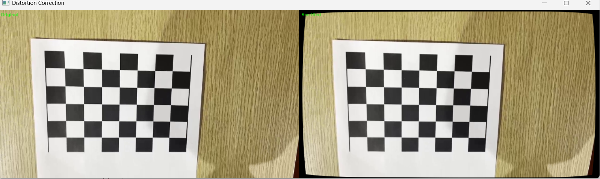

# 📷 Camera Calibration & Distortion Correction

## 📌 Description
OpenCV를 이용하여 체스보드 영상을 기반으로 카메라 캘리브레이션을 수행하고,
추정된 파라미터를 활용하여 렌즈 왜곡을 보정하였다.

---

## 📂 Input Data

- `chessboard.mp4` : 캘리브레이션용 체스보드 영상

---

## ⚙️ Method

### 1. Camera Calibration

체스보드 패턴을 이용하여 카메라 내부 파라미터를 추정하였다.

- `cv.findChessboardCorners()`로 코너 검출
- `cv.cornerSubPix()`로 코너 위치 정밀화
- 여러 프레임에서 3D-2D 대응점 수집
- `cv.calibrateCamera()`로 카메라 행렬 및 왜곡 계수 계산

체스보드 내부 코너는 `(7, 5)`를 사용하였다.

---

### 2. Distortion Correction

추정된 카메라 파라미터를 이용하여 영상의 렌즈 왜곡을 보정하였다.

- `cv.getOptimalNewCameraMatrix()` 사용
- `cv.undistort()`로 왜곡 제거
- 원본 영상과 보정 결과를 비교

---

## 📊 Camera Calibration Result

### ✔ Intrinsic Parameters
## 🎥 Demo (Youtube) 

fx = 1205.52
fy = 1212.35
cx = 644.91
cy = 357.92

---

### ✔ Camera Matrix
[[1.20552422e+03 0.00000000e+00 6.44908485e+02]
 [0.00000000e+00 1.21234616e+03 3.57918243e+02]
 [0.00000000e+00 0.00000000e+00 1.00000000e+00]]

---

### ✔ Distortion Coefficients
k1 = 0.27470
k2 = -1.82186
p1 = 0.00078
p2 = -0.00374
k3 = 4.29484

---

### ✔ RMSE
RMSE = 0.2988223920827532

---

## 🧪 Result

왜곡 보정 결과, 이미지의 가장자리에서 발생하던 곡선 형태의 왜곡이 감소하고
직선이 보다 자연스럽게 표현되는 것을 확인할 수 있었다.

---

## ⚠️ Limitations

- 체스보드 검출은 조명과 각도에 영향을 받음
- 충분한 다양한 시점의 데이터가 필요함
- 체스보드가 일부 가려지면 검출 실패
- 데이터가 너무 많을 경우 연산 시간이 증가함
- 영상 크기가 클 경우 출력 화면이 잘릴 수 있어 resize 필요

---

## 💡 Notes

- 캘리브레이션에는 약 30장의 프레임을 사용하였다.
- 왜곡 보정 과정에서 일부 가장자리 영역이 잘릴 수 있다.
- 출력 영상은 화면 크기에 맞게 resize하여 표시하였다.
